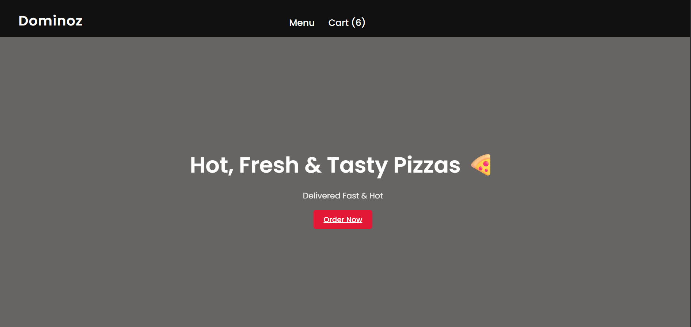
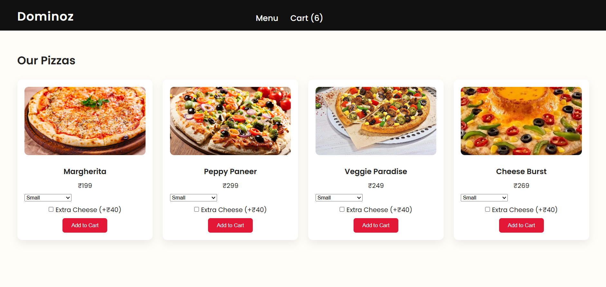
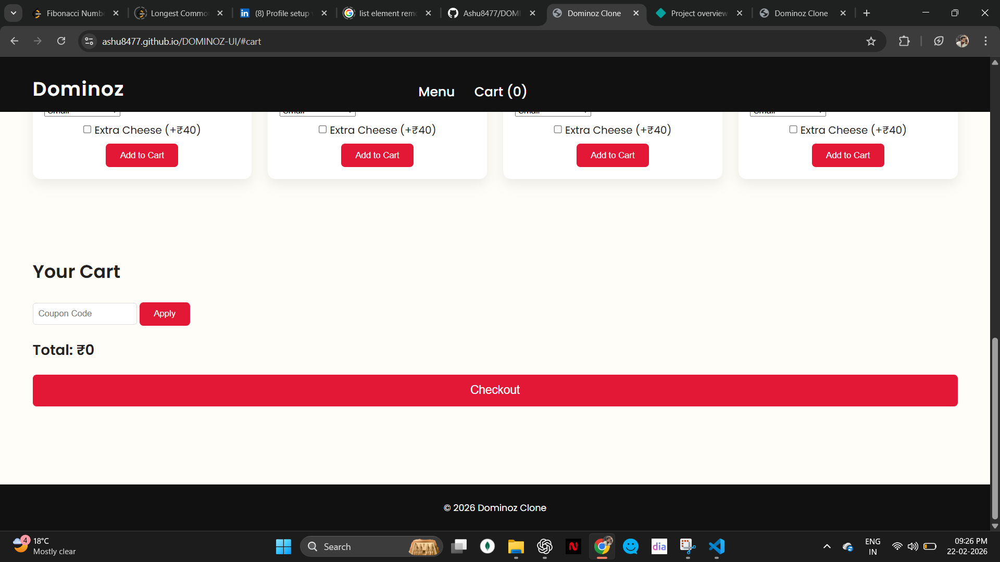

<<<<<<< HEAD

# 🍕 Dominoz UI

A modern Domino’s inspired food ordering website built with pure HTML, CSS & JavaScript.

## 🚀 Live Demo

https://ashu8477.github.io/DOMINOZ-UI/

## ✨ Features

- Responsive design
- Interactive cart (LocalStorage)
- Smooth animations
- Clean UI

## 🛠 Tech Stack

- HTML5
- CSS3
- JavaScript

## 📸 Screenshots

### 🏠 Home Page

### 🍕 Pizza Items Section

### 🛒 Cart Page

---

# ⭐ If you like this project, give it a star!

"# DOMINOZ-UI"
